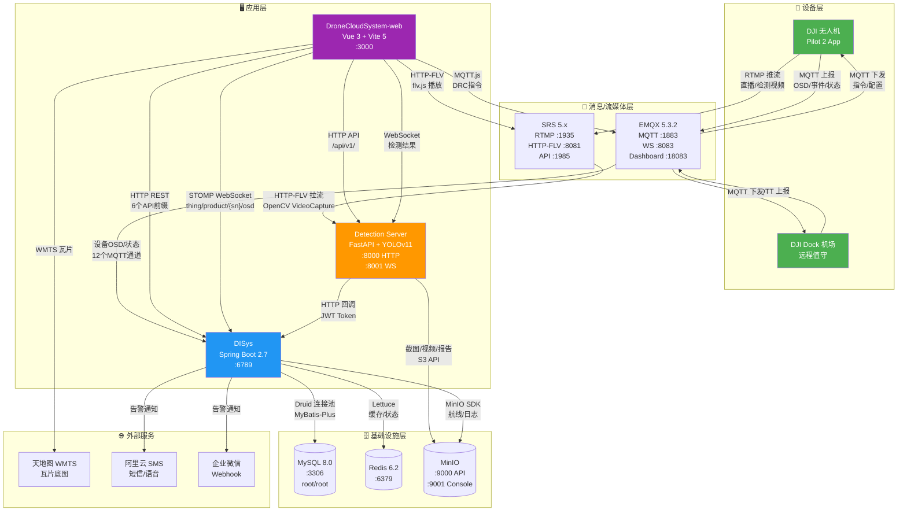
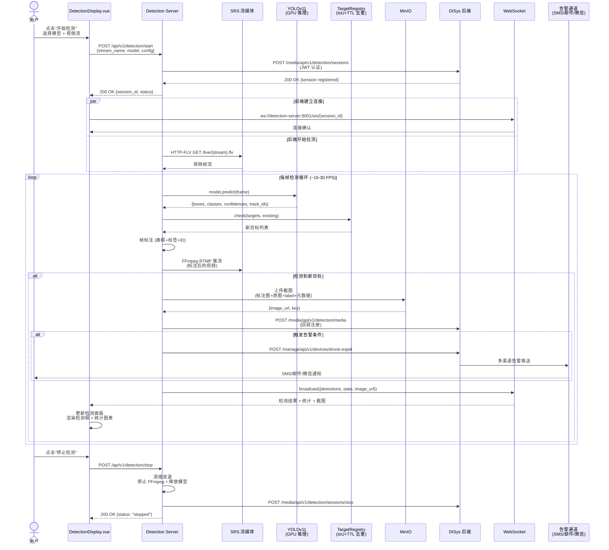
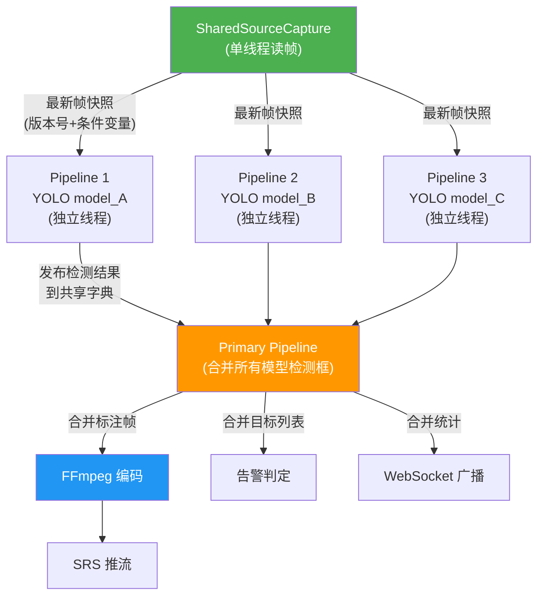
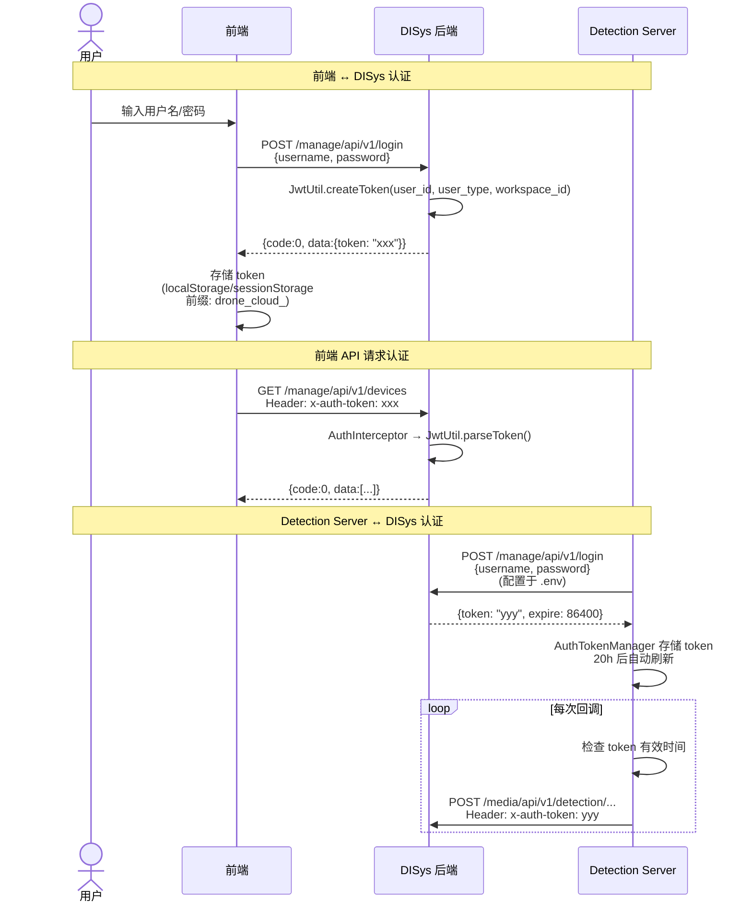
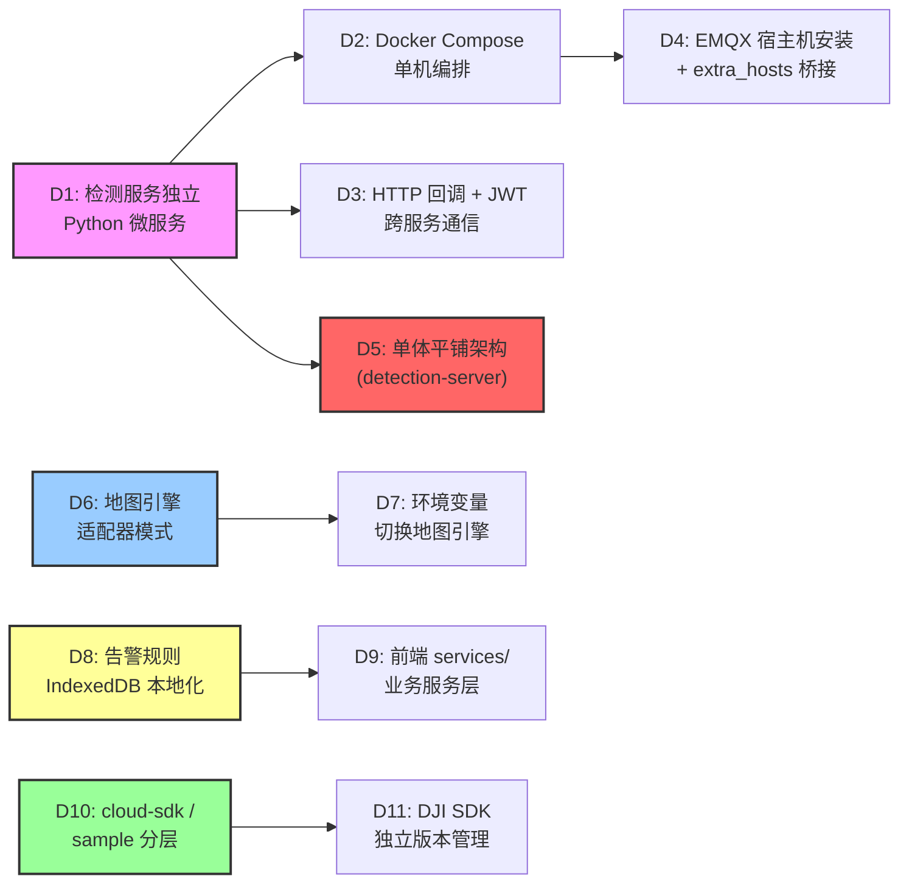

# 无人机智慧巡检平台 — 系统架构文档

> 架构师视角三阶段分析：P1 全局拓扑 · P2 关键路径 · P3 设计决策
>
> 生成时间：2026-06-08 · 基于 DISys / DroneCloudSystem-web / DroneCloudSystem_detection-server 三个仓库

---

## 概览

| 维度 | 内容 |
|------|------|
| **项目名称** | 无人机智慧巡检平台（Drone Cloud Inspection Platform） |
| **定位** | 基于 DJI Cloud API 的行业级无人机远程管控 + AI 实时检测 + 巡检管理平台 |
| **子项目数** | 3 个独立 Git 仓库 + 1 个本地开发模拟器项目 |
| **总代码量** | ~50,000+ 行（不含依赖、生成代码、node_modules） |
| **技术栈** | Spring Boot 2.7 / Vue 3 / FastAPI + YOLOv11 |
| **基础设施** | MySQL / Redis / MinIO / EMQX / SRS（Docker Compose 编排） |
| **核心能力** | 设备远程控制(DRC)、航线规划与自主飞行、实时视频流 AI 检测、告警驱离、巡检报告生成 |

### 子项目一览

| 子项目 | 技术栈 | 代码量级 | 端口 | 语言 |
|--------|--------|----------|------|------|
| **DISys**（后端） | Spring Boot 2.7.12 + Java 11 + MyBatis-Plus 3.4.2 | ~38,000 行 Java（1092 文件） | :6789 | Java |
| **DroneCloudSystem-web**（前端） | Vue 3.3 + Vite 5.4 + Pinia 2.1 + Ant Design Vue 4 | ~43,000 行 Vue/JS/TS（~195 源文件） | :3000(开发) | JavaScript/TypeScript |
| **DroneCloudSystem_detection-server**（AI 检测） | Python FastAPI 0.104 + YOLOv11 (Ultralytics 8.0) | ~9,000 行 Python（18 核心模块） | :8000(HTTP) / :8001(WS) | Python |
| **DroneCloudSystem_virtual-dock-simulator**（本地模拟器） | Vue 3 + Vite + Express + mqtt.js | 本地开发专用 | :3100(UI) / :3101(API) | TypeScript |

### 核心数据流

```
DJI 设备 ──MQTT──▶ EMQX ──▶ DISys(Spring Boot) ──▶ MySQL / Redis / MinIO
                                        │
DJI 设备 ──RTMP──▶ SRS ◀──── HTTP-FLV ─┤
                    │                    │
                    ├──▶ Detection Server ──YOLOv11推理──▶ 标注帧
                    │         │                              │
                    │         ├──▶ FFmpeg编码 ──▶ SRS推流(标注视频)
                    │         ├──▶ MinIO(截图/报告)
                    │         ├──▶ DISys(会话注册/告警回调)
                    │         └──▶ WebSocket(实时推送前端)
                    │
Web 前端 ◀──HTTP REST──▶ DISys
Web 前端 ◀──WebSocket──▶ Detection Server
Web 前端 ◀──STOMP WS──▶ DISys (设备OSD)
Web 前端 ──MQTT──▶ EMQX (DRC遥控指令)
```

---

## P1 · 全局拓扑

### 1.1 目录结构

```
无人机智慧巡检平台/
│
├── DISys/                              # 后端主业务服务
│   ├── source/backend_service/         # Maven 多模块项目
│   │   ├── cloud-sdk/                  # DJI Cloud API SDK（~554 文件）
│   │   │   └── com.dji.sdk             #   设备协议、MQTT 编解码、WebSocket
│   │   └── sample/                     # 主业务应用（~538 文件）
│   │       └── com.dji.sample          #   12 个业务模块 + 入口类
│   ├── data/                           # MySQL/MinIO/SRS 持久化数据挂载
│   ├── scripts/                        # 部署/构建/监控脚本
│   ├── docker-compose.yml              # 基础设施编排（6 个服务）
│   └── docs/                           # 架构文档、OpenAPI、交接指南
│
├── DroneCloudSystem-web/               # 前端控制台
│   ├── src/
│   │   ├── views/                      # 29 个页面级 Vue 组件
│   │   ├── components/                 # 45+ 可复用组件（含子目录）
│   │   ├── store/ + stores/            # 18 个 Pinia Store（两个目录迁移遗留）
│   │   ├── api/                        # 15 个 API 模块（多后端 axios 实例）
│   │   ├── map/                        # 地图引擎抽象层（IMapAdapter 接口）
│   │   ├── composables/                # 26 个 Vue 3 组合式函数
│   │   ├── services/                   # 业务服务层（告警引擎、设备管理）
│   │   ├── config/                     # 运行时配置（URL、权限、MQTT）
│   │   ├── router/                     # Vue Router 路由定义
│   │   ├── utils/                      # 36 个工具函数
│   │   └── locales/                    # i18n 中英文翻译
│   ├── media-server/                   # RTMP→HTTP-FLV 流媒体中转（node-media-server）
│   ├── e2e/                            # Playwright E2E 测试
│   ├── tests/                          # Vitest 单元测试
│   └── docs/                           # 架构文档、OpenAPI
│
├── DroneCloudSystem_detection-server/  # AI 检测微服务
    ├── main.py                         # FastAPI 入口 + 全部 HTTP 路由（1804 行）
    ├── detection_engine.py             # 单会话检测引擎（1006 行）
    ├── detection_group_runtime.py      # 多模型检测组（1089 行）
    ├── offline_detection_engine.py     # 离线视频检测（536 行）
    ├── websocket_server.py             # WebSocket 实时推送（458 行）
    ├── minio_client.py                 # MinIO 对象存储客户端（791 行）
    ├── backend_api_client.py           # 后端 API 客户端 + JWT（459 行）
    ├── alarm_trigger.py                # 告警触发器（346 行）
    ├── config.py                       # 环境变量/参数配置（328 行）
    ├── models.py                       # Pydantic v2 数据模型（234 行）
    ├── model_config_loader.py          # YAML 模型配置加载（295 行）
    ├── video_output_helpers.py         # FFmpeg 输出辅助（256 行）
    ├── ffmpeg_api.py                   # FFmpeg 转码 API（394 行）
    ├── detection_api.py                # 检测图片 API（264 行）
    ├── detection_target_registry.py    # 目标去重注册表（96 行）
    ├── report_generator.py             # HTML 检测报告（200 行）
    ├── docx_report_generator.py        # DOCX 检测报告（192 行）
    ├── yolo_label_generator.py         # YOLO label 生成（69 行）
    ├── models/                         # YOLO 模型权重 (.pt) + YAML 配置
    └── templates/                      # Jinja2 HTML 报告模板
│
└── DroneCloudSystem_virtual-dock-simulator/   # 本地虚拟机场控制台
    ├── src/ui/                         # Vue 3 控制台
    ├── src/server/                     # Express 本地 API
    ├── src/shared/                     # 共享类型与消息模型
    └── data/                           # 本地状态文件
```

### 1.2 模块量化

#### DISys 后端模块（按代码量排序）

| 模块 | 包路径 | 文件数 | 行数 | 职责定义 |
|------|--------|--------|------|----------|
| manage | `sample.manage` | 162 | ~9,037 | 设备/用户/工作空间/固件/直播 |
| component | `sample.component` | 54 | ~4,379 | MQTT/WebSocket/OSS/Redis 基础设施 |
| simulation | `sample.simulation` | 26 | ~4,345 | 模拟仿真训练（不再承担真实设备链路联调主路径） |
| media | `sample.media` | 59 | ~7,079 | 媒体文件/视频/AI检测报告 |
| wayline | `sample.wayline` | 57 | ~3,765 | 航线文件/飞行任务/AI检测配置 |
| worker | `sample.worker` | 32 | ~2,736 | 巡检员/检测事件/审计日志 |
| map | `sample.map` | 50 | ~2,369 | 地图数据/电子围栏 |
| control | `sample.control` | 44 | ~1,832 | 设备远程控制(Dock/DRC) |
| detection | `sample.detection` | 18 | ~1,724 | AI检测/入侵威慑（桥接层） |
| common | `sample.common` | 11 | ~1,102 | JWT/权限/操作日志/响应封装 |
| inspection | `sample.inspection` | 25 | ~1,096 | 巡检计划/飞行时段 |
| feedback | `sample.feedback` | 14 | ~933 | 用户反馈 |
| ai | `sample.ai` | 15 | ~867 | AI对话/历史记录 |
| flight | `sample.flight` | 8 | ~413 | 飞行任务历史 |
| configuration | `sample.configuration` | 8 | ~378 | 配置管理 |
| storage | `sample.storage` | 3 | ~91 | 存储抽象 |
| **合计** | | **~538** | **~38,000** | |

#### Detection Server 模块

| 文件 | 行数 | 职责定义 |
|------|------|----------|
| main.py | ~1,804 | HTTP API 路由（检测/模型/推理/健康） |
| detection_group_runtime.py | ~1,089 | 多模型检测组并行推理 |
| detection_engine.py | ~1,006 | 单会话检测引擎 |
| minio_client.py | ~791 | MinIO 截图/视频/元数据/搜索/回调 |
| offline_detection_engine.py | ~536 | 离线视频逐帧检测 |
| backend_api_client.py | ~459 | 后端 API + JWT 自动刷新 |
| websocket_server.py | ~458 | WebSocket 连接管理/广播 |
| ffmpeg_api.py | ~394 | GPU 加速视频转码 |
| alarm_trigger.py | ~346 | 告警频率控制/多级别告警 |
| config.py | ~328 | 环境变量解析/参数配置 |
| model_config_loader.py | ~295 | YAML 模型配置 + 自动发现 |
| video_output_helpers.py | ~256 | FFmpeg 输出帧率控制/编码器选择 |
| report_generator.py | ~200 | Jinja2 HTML 报告 |
| docx_report_generator.py | ~192 | python-docx 报告 |
| detection_api.py | ~264 | 检测图片浏览/搜索/摘要 |
| models.py | ~234 | Pydantic v2 请求/响应模型 |
| detection_target_registry.py | ~96 | IoU + TTL 目标去重 |
| yolo_label_generator.py | ~69 | YOLO 归一化坐标生成 |
| **合计** | **~9,000** | |

#### 前端页面组件（按代码量排序 Top 10）

| 组件 | 行数 | 功能 |
|------|------|------|
| MissionPlanning.vue | ~6,263 | 任务规划（地图交互 + 航线编辑） |
| DetectionDisplay.vue | ~5,278 | AI 检测实时展示面板 |
| AlarmManagement.vue | ~3,482 | 告警规则管理 + HMS 报警 |
| FlightControl.vue | ~3,091 | 飞行控制 + 实时视频 + DRC |
| UpgradeMaintenance.vue | ~2,440 | 系统升级维护 |
| UserManagement.vue | ~2,326 | 用户管理 |
| DataStorage.vue | ~2,090 | 数据存储管理 |
| WaylineManagement.vue | ~1,889 | 航线文件管理 |
| SystemMaintenance.vue | ~1,788 | 系统维护 |
| FeedbackForum.vue | ~1,593 | 问题反馈论坛 |

### 1.3 Mermaid 拓扑图



### 1.4 DISys 后端 API 路由表（37 个 Controller）

| 前缀 | 模块 | Controller 数 | 关键 Controller |
|------|------|---------------|----------------|
| `/manage/api/v1/` | manage | 10 | Device, User, Login, Workspace, LiveStream, Topology, Firmware, HMS, Logs, OperationLog |
| `/media/api/v1/` | media | 8 | Media, File, AIReport, DetectionResult, Dataset, OfflineDetection, VideoPlayback, BatchVideo |
| `/wayline/api/v1/` | wayline | 3 | WaylineJob, WaylineFile, WaylineAIDetectionConfig |
| `/control/api/v1/` | control | 2 | Dock, DRC |
| `/map/api/v1/` | map | 3 | FlightArea, WorkspaceElement, DeviceData |
| `/detection/api/v1/` | detection | 1 | AIDetection |
| `/ai/api/v1/` | ai | 2 | AI, AIHistory |
| `/inspection/api/v1/` | inspection | 1 | InspectionPlan |
| `/alarm/api/v1/` | alarm | 1 | AlarmNotification |
| `/feedback/api/v1/` | feedback | 1 | Feedback |
| `/storage/api/v1/` | storage | 1 | Storage |
| `/simulation/api/v1/` | simulation | 1 | Scenario |
| `/worker/api/v1/` (manage 前缀) | worker | 1 | Worker |

### 1.5 Detection Server API 路由表

| 方法 | 路径 | 处理模块 | 说明 |
|------|------|---------|------|
| GET | `/health` | main.py | 健康检查（GPU/MinIO/后端状态） |
| GET | `/api/v1/models` | main.py | 可用模型列表 |
| GET | `/api/v1/models/{name}` | main.py | 模型详情 |
| POST | `/api/v1/models/upload` | main.py | 上传新模型（.pt + .yaml） |
| POST | `/api/v1/models/{name}/update` | main.py | 更新模型（含类别一致性检查） |
| POST | `/api/v1/models/reload` | main.py | 管理员刷新模型列表 |
| POST | `/api/v1/detection/start` | main.py | 启动单会话实时检测 |
| POST | `/api/v1/detection/stop` | main.py | 停止单会话检测 |
| POST | `/api/v1/detection/groups/start` | main.py | 启动多模型检测组 |
| POST | `/api/v1/detection/groups/stop` | main.py | 停止检测组 |
| GET | `/api/v1/detection/groups/{id}/status` | main.py | 检测组状态 |
| GET | `/api/v1/detection/groups` | main.py | 列出所有检测组 |
| POST | `/api/v1/detection/image` | main.py | 单张图片推理（同步） |
| POST | `/api/v1/detection/video` | main.py | 视频文件推理（异步） |
| GET | `/api/v1/detection/inference/{id}/status` | main.py | 文件推理状态 |
| GET | `/api/v1/detection/inference/{id}/download-report` | main.py | 下载 DOCX 推理报告 |
| POST | `/api/v1/detection/offline/start` | main.py | 启动离线视频检测 |
| GET | `/api/v1/detection/offline/{id}/status` | main.py | 离线检测状态 |
| GET | `/api/v1/detection/sessions/{sid}/images` | detection_api.py | 会话检测图片 |
| GET | `/api/v1/detection/sessions/{sid}/images/search` | detection_api.py | 高级搜索分页 |
| GET | `/api/v1/detection/sessions/{sid}/summary` | detection_api.py | 会话摘要 |
| GET | `/api/v1/detection/sessions/{sid}/classes` | detection_api.py | 会话类别统计 |
| GET | `/api/v1/detection/images/{key}/original` | detection_api.py | 原图 URL |
| GET | `/api/v1/detection/images/{key}/label` | detection_api.py | YOLO label 内容 |
| POST | `/api/v1/ffmpeg/process` | ffmpeg_api.py | GPU 视频转码 |
| POST | `/api/v1/ffmpeg/cover` | ffmpeg_api.py | 视频封面截图 |
| GET | `/api/v1/ffmpeg/status/{id}` | ffmpeg_api.py | 转码状态 |
| GET | `/api/v1/ffmpeg/health` | ffmpeg_api.py | FFmpeg 健康检查 |

### 1.6 前端路由地图（26 条路由）

| 路由 | 组件 | 权限 |
|------|------|------|
| `/login` | Login.vue | 公开 |
| `/register` | Register.vue | 公开 |
| `/worker/scan` | WorkerQRCodeScan.vue | 公开 |
| `/` | MissionPlanning.vue | 管理员默认首页 |
| `/flight-plan` | → 重定向 `/` | |
| `/wayline-management` | WaylineManagement.vue | 认证 |
| `/flight-control` | FlightControl.vue | 认证 |
| `/detection-display` | DetectionDisplay.vue | 访客默认首页 |
| `/alarm-management` | AlarmManagement.vue | 认证 |
| `/data-storage` | DataStorage.vue | 认证 |
| `/log-management` | LogManagement.vue | 认证 |
| `/user-management` | UserManagement.vue | 认证 |
| `/upgrade-maintenance` | UpgradeMaintenance.vue | 认证 |
| `/user-profile` | UserProfile.vue | 认证 |
| `/feedback-forum` | FeedbackForum.vue | 认证 |
| `/operation-log` | OperationLogManagement.vue | 认证 |
| `/worker-qrcode-generator` | WorkerQRCodeGenerator.vue | 认证 |
| `/worker-detection-alert` | WorkerDetectionAlert.vue | 认证 |
| `/ai-positioning-measurement` | AIPositioningMeasurement.vue | 认证 |
| `/ai-quality-assessment` | AIQualityAssessment.vue | 认证 |
| `/ai-construction-progress` | AIConstructionProgress.vue | 认证 |
| `/ai-data-management` | AIDataManagement.vue | 认证 |
| `/remote-debug` | RemoteDebug.vue | 认证 |
| `/simulation` | SimulationDashboard.vue | 教育模式 |

### 1.7 基础设施详情

#### Docker Compose 服务（DISys/docker-compose.yml）

| 服务 | 镜像 | 端口映射 | 内存限制 | 数据卷 |
|------|------|---------|---------|--------|
| cloud_api_sample | 自建 (Maven + JDK 11) | 6789:6789 | 4096M | application.yml 挂载 |
| mysql | dji/mysql:latest | 3306:3306 | 512M | ./data/mysql |
| redis | redis:6.2 | 6379:6379 | 128M | 无持久化 |
| minio | minio/minio:latest | 9000:9000, 9001:9001 | 512M | ./data/minio |
| srs | ossrs/srs:5 | 1935:1935, 8081:8080, 1985:1985 | 128M | ./data/srs |

- 网络：自定义桥接 `192.168.6.0/24`
- EMQX：宿主机安装（非 Docker），通过 `extra_hosts: host-gateway` 桥接
- Detection Server：宿主机 conda 环境运行（GPU 直通需求）

#### 数据库 Schema（40 个实体，Flyway 管理）

**DJI 原始表**（SDK baseline）：
- `manage_device`, `manage_user`, `manage_workspace`, `manage_device_payload`
- `wayline_file`, `wayline_job`, `media_file`, `map_*` 系列

**自定义扩展表**（Flyway V1-V10）：

| 迁移版本 | 新增表 | 业务 |
|---------|--------|------|
| V1 | `ai_detection_session`, `ai_report_task` | AI 检测会话 + 报告 |
| V2 | `detection_result_media` | 检测结果媒体 |
| V3 | `offline_detection_task` | 离线检测任务 |
| V6 | `wayline_ai_detection_config` | 航线 AI 检测配置 |
| V8 | `flight_task_history` | 飞行任务遥测历史 |
| V10 | `simulation_scenario`, `simulation_session` | 仿真训练 |
| — | `worker`, `worker_event`, `scan_event`, `audit_log` | 巡检员体系 |
| — | `alarm_rule`, `alarm_record`, `notification_*` | 告警通知体系 |
| — | `inspection_plan`, `plan_item`, `config`, `flight_slot` | 巡检计划 |
| — | `feedback`, `feedback_reply` | 用户反馈 |
| — | `ai_history` | AI 对话历史 |

### 1.8 健康度速查

| 维度 | 评估 | 详情 |
|------|------|------|
| **God Module** | ⚠️ 警告 | detection-server `main.py`（1804行）、前端 `MissionPlanning.vue`（6263行）、`DetectionDisplay.vue`（5278行）、`App.vue` 含大量全局逻辑 |
| **代码分层** | ⚠️ 不均衡 | detection-server 所有源文件平铺根目录无分层；DISys 和前端分层良好 |
| **循环依赖** | ✅ 无 | 三个子项目之间为单向依赖：DET→DISys, WEB→DISys, WEB→DET |
| **跨层调用** | ⚠️ 存在 | 前端 `stores/` 与 `store/` 两目录并存（迁移遗留）；新增 store 应放 `store/` |
| **测试覆盖** | ❌ 低 | detection-server 无测试文件；前端有 Vitest + Playwright 但覆盖率未知；DISys 有部分单测 |
| **配置管理** | ✅ 良好 | 三个项目均有 `.env` 分离 + `application.yml` / `config.py` 配置分离 |
| **文档门禁** | ✅ 优秀 | CI 检查 + pre-commit hook 强制文档同步（三个仓库统一） |
| **依赖管理** | ✅ 良好 | DISys Maven 锁版本、前端 package-lock.json、detection requirements.txt |
| **安全性** | ⚠️ 可接受 | JWT Token 认证、SSRF 防护、路径遍历防护；但 CORS 允许 `*`（detection-server） |

---

## P2 · 关键路径

### 2.1 路径选择

选取 **实时 AI 检测全链路** — 从用户在前端发起检测到收到实时告警推送的完整过程。

**选择理由**：这是平台最核心、最复杂的业务流程，横跨三个子项目和五个基础服务（SRS/EMQX/MinIO/MySQL/Redis），涉及视频流、ML 推理、实时通信、对象存储、跨服务回调等多个技术域。

### 2.2 逐层追踪

```
═══════════════════════════════════════════════════════════════
入口: POST /api/v1/detection/start
文件: detection-server/main.py
请求: DetectionStartRequest { stream_name, model_name, config }
═══════════════════════════════════════════════════════════════

[Step 1] main.py: 解析请求参数
    → _resolve_source_stream_url(stream_name, video_stream_url)
    → 构建完整 SRS 拉流地址: http://{SRS_HOST}:{SRS_HTTP_PORT}/live/{stream_name}.flv
    → 加载 YOLO 模型配置: model_config_loader.get_model_config(model_name)

[Step 2] main.py: 创建 DetectionEngine
    → DetectionEngine(session_id, model_path, config)
    → 注册到全局字典: detection_sessions[session_id] = engine
    → 回调后端注册会话: backend_api_client.create_session()

[Step 3] detection_engine.py: 启动检测循环
    → 加载 YOLO 模型: YOLO(model_path)
    → 打开视频源: cv2.VideoCapture(srs_http_flv_url)
    → 进入帧处理循环:
        │
        ├─ [3a] 读取帧: cap.read()
        │
        ├─ [3b] YOLO 推理: model.predict(frame, conf, iou)
        │   → 返回: boxes, classes, confidences, track_ids
        │
        ├─ [3c] 目标去重: DetectionTargetRegistry.check()
        │   → IoU + TTL 机制，track_id 优先，bbox IoU 回退
        │   → 确保同一目标只保存一次截图
        │
        ├─ [3d] 帧标注: model.plot(frame, results)
        │   → 画检测框 + 标签 + 置信度 + 跟踪 ID
        │
        ├─ [3e] 输出推流: video_output_helpers.launch_output_process()
        │   → FFmpeg 子进程编码（GPU h264_nvenc / CPU libx264 自动选择）
        │   → RTMP 推流回 SRS: rtmp://{SRS_HOST}:{SRS_RTMP_PORT}/live/{output_name}
        │   → RealtimeOutputPump 有界队列控制帧率，满队列丢帧保护实时性
        │
        ├─ [3f] 截图上传: minio_client.upload_annotated_image()
        │   → 上传标注图 + 原图 + YOLO label + 元数据 JSON 到 MinIO
        │   → 回调 DISys 注册媒体: _register_media_file()
        │
        ├─ [3g] 告警判定: alarm_trigger.trigger_alarm()
        │   → 频率控制: 5 分钟间隔（驱离模式 3 秒短周期）
        │   → 多级别: Critical / Warning / Emergency
        │   → 回调 DISys: backend_api_client.trigger_drone_expel()
        │
        └─ [3h] WebSocket 广播: websocket_server.broadcast()
            → 按 session_id 分组推送
            → 消息类型: detection_result / statistics / status_change

[Step 4] 前端接收（并发执行）
    │
    ├─ [4a] DetectionDisplay.vue: WebSocket 消息处理
    │   → useAiDetectionWebSocket() 连接 ws://detection-server:8001/ws
    │   → 接收检测结果 JSON → 更新 Vue 响应式数据
    │   → 渲染检测框叠加层 + 统计面板 + 告警通知
    │
    ├─ [4b] DetectionDisplay.vue: 视频流播放
    │   → flv.js 播放 SRS HTTP-FLV 流: http://srs:8081/live/{output_name}.flv
    │   → 标注后的视频流实时播放
    │
    └─ [4c] DISys 后端: 回调处理
        → MediaController: 注册检测截图到数据库
        → AIDetectionReportController: 更新检测报告
        → AlarmNotificationController: 发送多渠道告警
            → 阿里云 SMS/语音
            → SMTP 邮件
            → 企业微信 Webhook
```

### 2.3 Mermaid 时序图



### 2.4 多模型检测组架构

Detection Server 支持三种检测模式，其中**多模型检测组**是最复杂的：



**关键设计**：
- `SharedSourceCapture` 单线程读帧，多管线共享最新帧快照，避免重复解码
- 每条管线独立线程，可加载不同 YOLO 模型（如安全帽检测 + 火灾检测并行）
- Primary Pipeline 合并所有模型的检测框后统一标注输出

### 2.5 边界标注

| 边界类型 | 位置 | 说明 |
|----------|------|------|
| **同步→异步** | `detection_engine.py` 帧循环 | 主线程同步读帧，推理在线程池，回调通过 `asyncio.run_coroutine_threadsafe` 桥接 |
| **进程边界** | `video_output_helpers.py` | FFmpeg 作为子进程启动，stdin 管道写入帧数据 |
| **序列化** | WebSocket 消息 | 检测结果序列化为 JSON（Pydantic model_dump），前端 JSON.parse 反序列化 |
| **网络边界** | HTTP-FLV / RTMP | 视频流跨网络协议，SRS 作为中继代理 |
| **存储边界** | MinIO S3 API | 截图/视频/报告从本地临时文件→MinIO 对象存储 |
| **认证边界** | JWT Token | Detection Server → DISys 回调使用独立 JWT，与前端 Token 无关 |
| **线程边界** | Detection Server | FastAPI async 路由 + 推理线程池 + `asyncio.run_coroutine_threadsafe` 跨线程回调 |

### 2.6 异常路径

| 异常场景 | 传播方式 | 最终用户体验 |
|----------|----------|-------------|
| **SRS 拉流失败** | DetectionEngine 捕获 `cv2.VideoCapture` 异常，标记 session error | 前端 WebSocket 收到 `status_change` 事件，显示"检测异常" |
| **YOLO 推理超时** | 帧被跳过，继续下一帧处理 | 视频流可能卡顿，检测框偶发缺失 |
| **MinIO 上传失败** | `minio_client.py` 捕获异常，记录日志，不中断检测循环 | 截图缺失，但检测继续运行 |
| **后端回调失败** | `backend_api_client.py` 自动重试 + JWT Token 自动刷新（20h/24h） | 会话/告警信息可能延迟或丢失 |
| **WebSocket 断连** | 前端自动重连机制（指数退避） | 检测结果暂时中断，重连后恢复 |
| **FFmpeg 进程崩溃** | `RealtimeOutputPump` 检测管道断裂，自动重启 FFmpeg | 视频流短暂中断后恢复 |
| **GPU OOM** | YOLO 推理失败，帧跳过，日志告警 | 检测质量下降，需人工干预释放 GPU |

### 2.7 认证链路



### 2.8 前端实时通信架构（三通道）

```
┌─────────────────────────────────────────────────────────────────────┐
│                       前端实时通信架构                                 │
├─────────────────────────────────────────────────────────────────────┤
│                                                                     │
│  通道 1: HMS WebSocket (STOMP 协议)                                 │
│  ├─ 实现: useOsdWebSocket.js (~3364 行)                             │
│  ├─ 连接: ws://{host}:6789/api/v1/ws                                │
│  ├─ 订阅: thing/product/{sn}/osd       (设备遥测: 位置/电量/姿态)     │
│  ├─ 订阅: thing/product/{sn}/events    (飞行事件: 起飞/降落/告警)     │
│  ├─ 心跳: 30s 间隔                                                   │
│  └─ 自动重连: 5s 间隔                                                │
│                                                                     │
│  通道 2: MQTT WebSocket (DRC 指令通道)                               │
│  ├─ 实现: useOsdWebSocket.js (connectMqtt)                          │
│  ├─ 连接: ws://{mqtt_host}:{mqtt_port}/mqtt                         │
│  ├─ 订阅: thing/product/{sn}/drc/up        (DRC 响应)               │
│  ├─ 订阅: thing/product/{sn}/services_reply (服务响应)               │
│  ├─ 订阅: thing/product/{sn}/events         (MQTT 事件)             │
│  └─ 用途: 飞行控制指令、相机控制、DRC 模式切换                        │
│                                                                     │
│  通道 3: Detection WebSocket (AI 检测结果)                           │
│  ├─ 实现: useAiDetectionWebSocket.js / useDetectionWebSocket.js     │
│  ├─ 连接: ws://{host}:8001/ws[/{sessionId}]                         │
│  └─ 用途: AI 检测实时结果流、检测状态更新、离线进度推送                │
│                                                                     │
│  附加通道:                                                           │
│  ├─ useHmsWebSocket.js          → 设备健康监测                       │
│  └─ useAlarmDetectionWebSocket  → 实时告警推送                       │
│                                                                     │
└─────────────────────────────────────────────────────────────────────┘
```

### 2.9 地图引擎架构（适配器模式）

```
                    IMapAdapter (TypeScript 接口, 458 行)
                    ├── Marker / Polyline / Polygon / Circle
                    ├── 相机控制 (中心/缩放/旋转/俯仰)
                    ├── 图层管理 (standard/satellite/hybrid)
                    └── 坐标转换 (lngLat ↔ pixel)

           ┌────────────────┴────────────────┐
    MapLibreAdapter.ts (2D)           CesiumAdapter.ts (3D)
    ├─ 天地图 WMTS 瓦片底图             ├─ 3D 地形渲染
    ├─ 轻量级，加载快                   ├─ 建筑物/地形高程
    └─ 适合日常巡检规划                 └─ 适合地形分析

    工厂函数: createMapAdapter('maplibre' | 'cesium')
    环境变量: VITE_MAP_ENGINE

    服务层:
    ├── MapDeviceRenderer.ts   → 设备标记渲染（机场/无人机图标）
    ├── WaypointPlanner.ts     → 航点规划（拖拽/连线/参数）
    └── DistanceMeasurer.ts    → 距离/面积测量
```

---

## P3 · 设计决策

### 决策 1：检测服务独立为 Python 微服务（而非嵌入 Java 后端）

| 维度 | 内容 |
|------|------|
| **选择了什么** | AI 检测逻辑独立为 Python FastAPI 微服务，通过 HTTP 回调 + JWT 认证与 Java 后端通信 |
| **约束上下文** | YOLOv11/Ultralytics 生态仅 Python 可用；Spring Boot 不适合 GPU 推理密集型任务；PyTorch 与 JVM 不兼容 |
| **放弃了什么** | ① 嵌入 Java 后端通过 JNI/ONNX Runtime 调用模型；② 使用 Java DL4J 等框架重写推理逻辑 |
| **正面影响** | Python AI 生态完整（Ultralytics/OpenCV/FFmpeg）；独立部署/扩缩容；GPU 驱动管理简单 |
| **负面影响** | 多语言技术栈维护成本增加；服务间 HTTP 回调有延迟；JWT Token 独立管理增加复杂度 |

**代码证据**：
- `detection-server/backend_api_client.py:459` — JWT 自动刷新 + HTTP 回调 DISys
- `DISys/.../detection/` — 仅做桥接/模拟，真实推理完全在 detection-server
- `detection-server/detection_engine.py:1006` — YOLO 模型加载 + GPU 推理核心逻辑

**前瞻判断**：当前阶段合理。10× 增长时需要引入消息队列（如 Redis Streams）替代 HTTP 回调，并考虑模型服务化（如 TorchServe/Triton）支持水平扩展。退化信号：回调延迟累积导致告警不及时。

---

### 决策 2：前端地图引擎适配器模式（MapLibre + Cesium 双引擎）

| 维度 | 内容 |
|------|------|
| **选择了什么** | 通过 `IMapAdapter` TypeScript 接口抽象地图操作，`createMapAdapter()` 工厂函数根据 `VITE_MAP_ENGINE` 环境变量动态加载 MapLibre GL 或 CesiumJS |
| **约束上下文** | 2D 地图需要轻量快速（日常巡检规划），3D 场景需要地形/建筑物渲染（施工监测），两者 SDK API 完全不同 |
| **放弃了什么** | ① 只用 Cesium（2D 性能差、包体积大）；② 只用 MapLibre（无 3D 能力）；③ Mapbox GL（商业授权限制） |
| **正面影响** | 按需加载减少包体积（Cesium 仅在 3D 模式加载）；业务代码与地图 SDK 完全解耦；可扩展第三引擎 |
| **负面影响** | 适配器接口维护成本；两个适配器需保持功能同步；接口能力受限于两者功能交集 |

**代码证据**：
- `web/src/map/types/IMapAdapter.ts:458` — 统一接口定义（Marker/Polyline/Polygon/Circle/相机控制）
- `web/src/map/adapters/index.ts` — 工厂函数 `createMapAdapter()`
- `web/src/map/adapters/MapLibreAdapter.ts` / `CesiumAdapter.ts` — 双适配器实现
- `web/src/map/services/MapDeviceRenderer.ts` — 设备渲染层，消除适配器重复代码

**前瞻判断**：优秀的架构选择。10× 增长时可无缝扩展第三引擎。退化信号：适配器接口频繁变更导致双端维护负担。

---

### 决策 3：Docker Compose 单机编排（vs Kubernetes）

| 维度 | 内容 |
|------|------|
| **选择了什么** | Docker Compose 编排所有基础设施（MySQL/Redis/MinIO/SRS），应用层也容器化部署 |
| **约束上下文** | 单/少节点部署场景（巡检行业通常边缘/私有化部署）；客户环境资源有限；K8s 运维复杂度高 |
| **放弃了什么** | ① Kubernetes 编排（自动扩缩容/服务发现）；② Docker Swarm |
| **正面影响** | `docker compose up -d` 一键启动全部服务；部署简单，适合边缘节点；资源占用低 |
| **负面影响** | 不支持自动扩缩容；无服务发现/负载均衡；多节点管理需手动 |

**代码证据**：
- `DISys/docker-compose.yml:202` — 5 个服务 + 自定义网络 `192.168.6.0/24`
- EMQX 宿主机安装，通过 `extra_hosts: host-gateway` 桥接
- Detection Server 宿主机运行（GPU 直通需求），非容器化

**前瞻判断**：当前阶段完全合理。巡检行业以私有化/边缘部署为主。退化信号：需要多节点集群或超过 3 台服务器时。

---

### 决策 4：告警规则引擎前端 IndexedDB 实现

| 维度 | 内容 |
|------|------|
| **选择了什么** | 前端 `src/services/alarmRuleEngine` 基于浏览器 IndexedDB 本地存储告警规则 |
| **约束上下文** | 快速原型需求；告警规则为用户个性化配置（非系统级共享数据）；参照 Qt 版本实现 |
| **放弃了什么** | ① 后端数据库存储（可跨设备/跨浏览器同步）；② 浏览器 localStorage（容量限制） |
| **正面影响** | 零后端改动快速上线；离线可用；容量比 localStorage 大 |
| **负面影响** | 无法跨设备同步规则；IndexedDB 数据可能被浏览器清理；无服务端备份 |

**代码证据**：
- `web/src/services/alarmRuleEngine.js` — IndexedDB 封装层

**前瞻判断**：当前阶段可接受的快速方案。退化信号：用户抱怨规则丢失或需要多设备同步时，应迁移到后端数据库。

---

### 决策 5：Detection Server 单体平铺架构

| 维度 | 内容 |
|------|------|
| **选择了什么** | 所有 Python 源文件平铺在项目根目录，`main.py` 包含全部 HTTP 路由（1804 行） |
| **约束上下文** | 项目早期快速迭代；单开发者主导；Python 微服务体量相对较小 |
| **放弃了什么** | ① 分层架构（routers/services/repositories）；② FastAPI Router 拆分到独立模块 |
| **正面影响** | 快速开发、文件查找直观、无需复杂的包导入路径 |
| **负面影响** | `main.py` 已成 God Module（1804 行）；难以单元测试；多人协作容易冲突 |

**代码证据**：
- `detection-server/main.py:1804` — 包含检测会话、模型管理、文件推理、离线检测、健康检查全部路由
- `detection_engine.py:1006` — 包含模型加载 + 帧循环 + 标注 + 截图 + 录像全部逻辑

**前瞻判断**：当前已接近退化临界点。`main.py` 突破 2000 行时应启动重构：按 FastAPI Router 拆分到 `routers/` 目录。退化信号：新功能开发减速、Bug 修复困难、多人冲突频繁。

---

### 决策 6：EMQX 宿主机安装（非 Docker）

| 维度 | 内容 |
|------|------|
| **选择了什么** | EMQX 5.3.2 直接安装在宿主机上，而非 Docker 容器 |
| **约束上下文** | EMQX 需要高性能网络 I/O；Docker 网络桥接会引入 MQTT 延迟；EMQX 管理端口多 |
| **放弃了什么** | ① Docker Compose 统一编排（一致性更好）；② EMQX 容器化（可移植性） |
| **正面影响** | MQTT 消息延迟最低；EMQX Dashboard 直接访问；网络配置简单 |
| **负面影响** | 部署步骤不统一（部分 Docker + 部分宿主机）；升级维护需要单独处理 |

**代码证据**：
- `DISys/docker-compose.yml:47-48` — `extra_hosts: host-gateway` 让容器访问宿主机 EMQX
- `DISys/docker-compose.yml:57-79` — EMQX 服务注释掉，注明使用宿主机安装

---

### 决策 7：cloud-sdk / sample Maven 模块分层

| 维度 | 内容 |
|------|------|
| **选择了什么** | DJI Cloud API SDK 封装在独立的 `cloud-sdk` Maven 模块，业务逻辑在 `sample` 模块 |
| **约束上下文** | DJI Cloud API 有自己的版本迭代节奏；SDK 协议层与业务逻辑关注点不同 |
| **放弃了什么** | ① 全部代码放在单一模块（耦合更紧）；② SDK 作为外部依赖引入 |
| **正面影响** | SDK 版本升级不影响业务代码；职责清晰；可独立测试 |
| **负面影响** | 模块间依赖管理需要维护；新开发者需要理解模块边界 |

**代码证据**：
- `DISys/source/backend_service/pom.xml` — 父 POM 定义 cloud-sdk + sample 两个模块
- `cloud-sdk/` 包含 MQTT 协议编解码、WebSocket 通信、设备 API 抽象（~554 文件）
- `sample/` 包含全部业务模块（~538 文件）

---

### 决策依赖图



### 前瞻判断汇总

| 决策 | 当前评估 | 10× 增长影响 | 退化信号 | 建议行动 |
|------|---------|-------------|----------|----------|
| D1: Python 微服务 | ✅ 合理 | 需消息队列替代 HTTP 回调 | 回调延迟 > 2s | 引入 Redis Streams |
| D2: Docker Compose | ✅ 合理 | 超过 3 节点时需迁移 | 手动扩容成为瓶颈 | 评估 K3s |
| D3: HTTP 回调 | ⚠️ 接近极限 | 需要异步事件驱动 | 告警延迟影响安全 | 改用消息队列 |
| D4: EMQX 宿主机 | ✅ 合理 | 无明显问题 | 无 | 保持现状 |
| D5: 单体平铺 | ⚠️ 临界 | 必须重构 | main.py > 2000 行 | FastAPI Router 拆分 |
| D6: 地图适配器 | ✅ 优秀 | 可扩展第三引擎 | 接口变更频繁 | 保持现状 |
| D7: 环境变量切换 | ✅ 良好 | 无明显问题 | 无 | 保持现状 |
| D8: IndexedDB | ⚠️ 技术债 | 必须迁移后端 | 用户投诉丢失 | 迁移到数据库 |
| D10: Maven 分层 | ✅ 优秀 | 无明显问题 | 无 | 保持现状 |

---

## 附录

### A. DISys 后端完整模块清单

| 模块 | 包路径 | 职责 | 核心依赖 | 被谁依赖 |
|------|--------|------|---------|----------|
| manage | `sample.manage` | 设备/用户/工作空间/固件/直播 | MySQL, Redis, MQTT, OSS, WebSocket | 几乎所有模块 |
| media | `sample.media` | 媒体文件/视频/AI检测报告 | MySQL, MinIO | detection, worker |
| wayline | `sample.wayline` | 航线/飞行任务/AI检测配置 | MySQL, OSS | manage, inspection |
| control | `sample.control` | 设备远程控制(Dock/DRC) | MQTT | manage |
| detection | `sample.detection` | AI检测桥接层 | media, HTTP client | media |
| worker | `sample.worker` | 巡检员/检测事件/审计 | MySQL | manage, media |
| inspection | `sample.inspection` | 巡检计划/飞行时段 | MySQL | wayline, manage |
| map | `sample.map` | 地图数据/电子围栏 | MySQL, Redis | manage, wayline |
| ai | `sample.ai` | AI对话/历史 | MySQL | — |
| alarm | `component.alarm` | 告警规则/多渠道通知 | MySQL, Redis, 阿里云SMS, SMTP | detection |
| feedback | `sample.feedback` | 用户反馈 | MySQL | manage |
| flight | `sample.flight` | 飞行历史 | MySQL | wayline |
| simulation | `sample.simulation` | 模拟仿真训练 | MySQL, Redis, Moquette(MQTT) | manage, control |
| component | `sample.component` | MQTT/WebSocket/OSS/Redis | 外部服务 | 所有模块 |
| cloud-sdk | `cloud-sdk` | DJI Cloud API 协议 | — | component, manage |
| storage | `sample.storage` | 存储管理 | MinIO | media |
| common | `sample.common` | JWT/权限/操作日志 | — | 所有模块 |

### B. 端口矩阵

| 服务 | 端口 | 协议 | 启动方式 | 说明 |
|------|------|------|----------|------|
| DISys | 6789 | HTTP | Docker Compose / Maven | 主业务 API |
| Detection Server | 8000 | HTTP | `python main.py` (conda) | AI 检测 API + Swagger UI |
| Detection Server | 8001 | WebSocket | 同上 | 检测结果实时推送 |
| SRS | 1935 | RTMP | Docker Compose | 视频推流 |
| SRS | 8081 | HTTP-FLV | 同上 | 视频拉流 |
| SRS | 1985 | HTTP | 同上 | SRS 管理 API |
| MySQL | 3306 | TCP | Docker Compose | 数据库 (root/root) |
| Redis | 6379 | TCP | Docker Compose | 缓存/状态 |
| MinIO | 9000 | HTTP | Docker Compose | 对象存储 API |
| MinIO | 9001 | HTTP | 同上 | MinIO 控制台 |
| EMQX | 1883 | MQTT | 宿主机安装 | 消息通道 |
| EMQX | 8083 | WebSocket | 同上 | MQTT over WebSocket |
| EMQX | 18083 | HTTP | 同上 | EMQX Dashboard |
| 前端 (dev) | 3000 | HTTP | `npm run dev` | Vite Dev Server |

### C. 预置 AI 模型清单

detection-server 预装 15+ 个 YOLOv11 检测模型：

| 模型名 | 检测目标 | 典型场景 |
|--------|---------|---------|
| helmet | 安全帽佩戴 | 施工现场安全 |
| firesafety | 消防设施/火灾 | 消防巡检 |
| engineeringvehicle | 工程车辆 | 施工监控 |
| puddle | 积水 | 道路/工地巡检 |
| ship | 船只/偷渡 | 海关巡查 |
| bridge_construction | 桥梁施工状态 | 桥梁巡检 |
| disaster_inspection | 灾后损毁 | 应急响应 |
| formwork_support | 模板支撑 | 建筑施工 |
| foundation_pit | 基坑状态 | 施工安全 |
| intrusion_detection | 异常闯入 | 安防监控 |
| material_stacking | 材料堆放 | 工地管理 |
| pipeline_safety | 管线安全 | 管线巡检 |
| safety_net | 防护网 | 高空作业 |
| safety_rope | 安全绳 | 高空作业 |
| site_appearance | 场容场貌 | 工地文明施工 |

另支持用户上传自定义模型（`.pt` 权重 + `.yaml` 配置），自动发现注册。

### D. 依赖矩阵

```
                    DISys    Detection-Server    Frontend
DISys                -          被回调              API 源
Detection-Server    调用           -              WS/HTTP 源
Frontend            调用          调用               -

MySQL              读写           -                -
Redis              读写           -                -
MinIO               -          读写的核心           -
SRS                  -          拉流/推流          拉流
EMQX              订阅/发布        -             订阅/发布
```

### E. 认证机制对比

| 维度 | 前端 ↔ DISys | Detection Server ↔ DISys |
|------|-------------|------------------------|
| **认证方式** | `x-auth-token` Header | `x-auth-token` Header |
| **Token 类型** | JWT（用户登录获取） | JWT（服务账号登录获取） |
| **Token 存储** | `localStorage` / `sessionStorage` | `AuthTokenManager` 内存存储 |
| **Token 前缀** | `drone_cloud_` | 无前缀 |
| **有效期** | — | 24h（20h 自动刷新） |
| **刷新策略** | 用户重新登录 | `backend_api_client.py` 自动刷新 |
| **失败处理** | 清除 Token → 跳转 `/login` | 重试 + 日志告警 |
